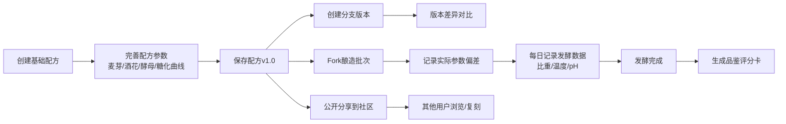

## 1. 产品概述

手工酿造配方版本管理与批次日志系统，为家庭酿酒师和精酿啤酒爱好者提供完整的配方管理、酿造记录和社区分享平台。解决酿酒过程中配方版本混乱、批次记录分散、经验难以沉淀的问题。

- 核心用户：家庭酿酒师、精酿啤酒爱好者、小型酿酒坊
- 核心价值：配方版本化管理、酿造过程数字化、经验可追溯分享

## 2. 核心功能

### 2.1 用户角色

| 角色 | 注册方式 | 核心权限 |
|------|----------|----------|
| 酿酒师 | 本地用户/无需注册（演示版） | 创建配方、管理批次、生成品鉴卡、分享配方 |
| 访客 | 无需注册 | 浏览社区公开配方、查看品鉴评分 |

### 2.2 功能模块

1. **配方管理**：基础配方创建、麦芽配比、酒花投放时刻表、酵母菌株、糖化温度曲线
2. **版本分支**：配方多版本管理、分支创建、版本对比、差异可视化
3. **批次日志**：从配方fork批次、实际参数偏差记录、发酵每日读数（比重、温度、pH值）
4. **品鉴评分**：成品酒评分卡、多维度评分（外观、香气、口感、整体）、与配方关联回溯
5. **社区分享**：配方模板公开分享、社区配方浏览、一键收藏复刻

### 2.3 页面详情

| 页面名称 | 模块名称 | 功能描述 |
|---------|----------|----------|
| 仪表盘 | 统计概览 | 配方数量、批次数量、发酵中批次、最近活动列表 |
| 配方列表 | 配方管理 | 配方卡片展示、搜索筛选、新建配方入口 |
| 配方详情 | 版本管理 | 配方参数展示、版本时间线、分支操作、版本对比 |
| 配方编辑 | 配方编辑 | 麦芽配比、酒花投放、酵母、糖化曲线表单编辑 |
| 批次列表 | 批次管理 | 批次卡片、状态筛选、新建批次入口 |
| 批次详情 | 发酵日志 | 批次详情、参数偏差、发酵读数记录、图表展示 |
| 品鉴评分 | 评分卡 | 多维度评分、品鉴笔记、与配方关联 |
| 社区广场 | 分享中心 | 公开配方列表、配方收藏、一键复刻到个人库 |

## 3. 核心流程

## 4. 用户界面设计

### 4.1 设计风格

- **主色调**：琥珀橙 (#D97706) - 代表啤酒色泽和温暖感
- **辅助色**：深棕 (#78350F)、麦芽黄 (#FDE68A)、酒花绿 (#15803D)
- **中性色**：米白背景 (#FFFBEB)、深灰文字 (#1C1917)
- **按钮风格**：圆润边角 (8px)、琥珀橙渐变、悬停微放大效果
- **字体**：标题使用 Playfair Display (优雅衬线)，正文使用 Inter (现代无衬线)
- **布局风格**：卡片式布局、温暖木质纹理背景、玻璃态悬浮卡片
- **图标风格**：Lucide 线性图标，统一琥珀色调

### 4.2 页面设计概览

| 页面名称 | 模块名称 | UI 元素 |
|---------|----------|---------|
| 仪表盘 | 统计概览 | 渐变数据卡片、发酵进度条、最近活动时间线、温暖渐变背景 |
| 配方列表 | 配方管理 | 网格卡片布局、琥珀色标签、悬停浮动效果、搜索筛选栏 |
| 配方详情 | 版本管理 | 时间线版本分支图、参数详情表格、对比视图切换按钮 |
| 配方编辑 | 配方编辑 | 动态表单、酒花投放时刻表、糖化温度曲线图预览 |
| 批次详情 | 发酵日志 | 温度/比重/pH 折线图表、参数偏差高亮对比、日志时间线 |
| 品鉴评分 | 评分卡 | 星级评分组件、雷达图多维度展示、品鉴笔记富文本 |
| 社区广场 | 分享中心 | Masonry 瀑布流布局、配方卡片、收藏/复刻按钮 |

### 4.3 响应式设计

- Desktop-first 设计，适配 1280px 以上
- 平板端 (768px)：侧边栏折叠、网格列数调整为 2 列
- 移动端 (480px)：底部导航栏、单列布局、表单纵向排列
- 触控优化：按钮最小 44x44px，滑动手势支持

### 4.4 动效设计

- 页面加载：元素渐入 + 轻微上移动画，stagger 延迟效果
- 卡片悬停：上浮 4px + 阴影增强 + 微妙缩放 (1.02)
- 版本对比：差异行高亮淡入动画
- 图表绘制：数据折线从左到右绘制动画
- 模态框：背景模糊 + 缩放弹出效果
