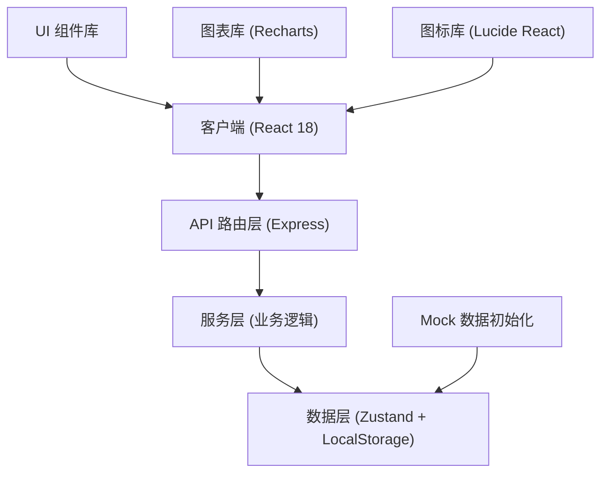
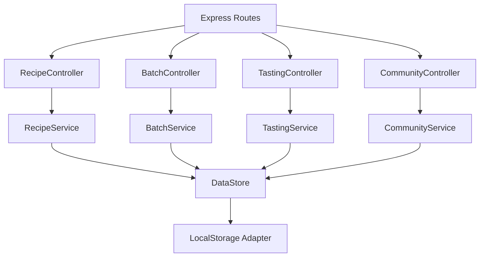
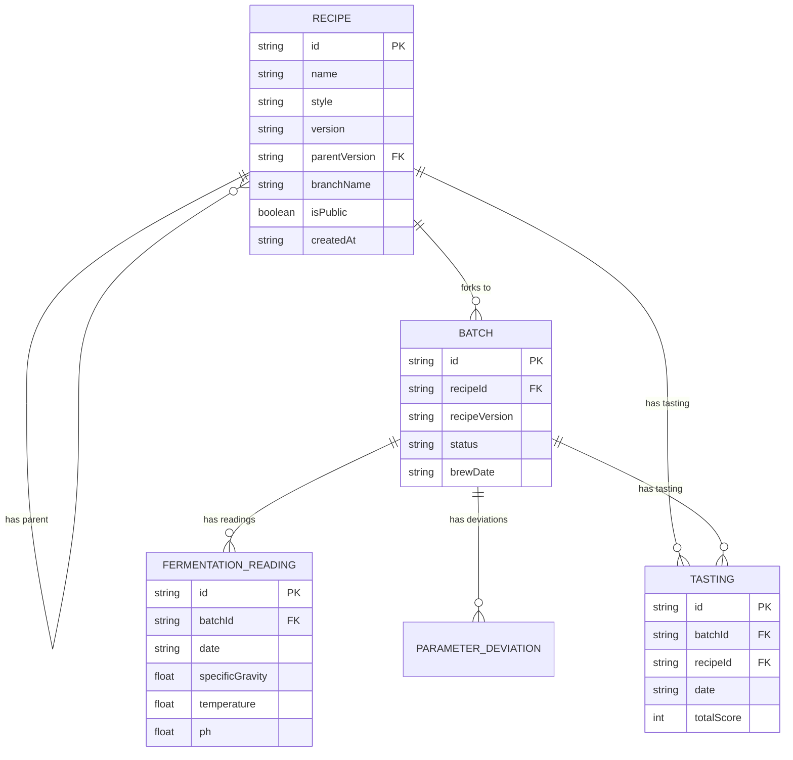

## 1. 架构设计



## 2. 技术描述

- **前端**：React@18 + TypeScript@5 + Vite@5 + TailwindCSS@3
- **后端**：Express@4 + TypeScript
- **状态管理**：Zustand
- **路由**：React Router DOM@6
- **图表**：Recharts
- **图标**：Lucide React
- **数据持久化**：LocalStorage (演示版)
- **初始化工具**：vite-init

## 3. 路由定义

| 路由 | 页面 | 用途 |
|------|------|------|
| `/` | 仪表盘 | 数据概览、快速操作 |
| `/recipes` | 配方列表 | 所有配方展示、搜索筛选 |
| `/recipes/new` | 新建配方 | 创建新配方 |
| `/recipes/:id` | 配方详情 | 配方参数、版本管理 |
| `/recipes/:id/edit` | 编辑配方 | 配方参数编辑 |
| `/recipes/:id/compare` | 版本对比 | 多版本参数差异对比 |
| `/batches` | 批次列表 | 所有酿造批次 |
| `/batches/:id` | 批次详情 | 发酵日志、参数偏差 |
| `/tastings` | 品鉴列表 | 所有品鉴评分卡 |
| `/tastings/new` | 新建品鉴 | 创建品鉴评分卡 |
| `/community` | 社区广场 | 公开配方分享 |

## 4. API 定义

### TypeScript 类型定义

```typescript
// 麦芽配比
interface MaltItem {
  id: string;
  name: string;
  weight: number; // kg
  color: string; // EBC
  percentage: number;
}

// 酒花投放
interface HopAddition {
  id: string;
  name: string;
  weight: number; // g
  alphaAcid: number; // %
  time: number; // 分钟
  stage: 'boil' | 'whirlpool' | 'dryhop';
}

// 酵母
interface Yeast {
  id: string;
  strain: string;
  brand: string;
  attenuation: number; // %
  temperature: [number, number]; // 温度范围
}

// 糖化温度点
interface MashStep {
  id: string;
  temperature: number; // °C
  duration: number; // 分钟
  description: string;
}

// 配方
interface Recipe {
  id: string;
  name: string;
  style: string; // 啤酒风格
  description: string;
  batchSize: number; // 升
  originalGravity: number; // 初始比重
  finalGravity: number; // 最终比重
  abv: number; // 酒精度
  ibu: number; // 苦度
  srm: number; // 色度
  malts: MaltItem[];
  hops: HopAddition[];
  yeast: Yeast;
  mashSteps: MashStep[];
  version: string; // 版本号 e.g. "1.0.0"
  parentVersion?: string; // 父版本
  branchName?: string; // 分支名
  isPublic: boolean;
  createdAt: string;
  updatedAt: string;
  createdBy: string;
}

// 发酵读数
interface FermentationReading {
  id: string;
  date: string;
  specificGravity: number; // 比重
  temperature: number; // °C
  ph: number;
  notes: string;
}

// 参数偏差
interface ParameterDeviation {
  parameter: string;
  expected: number;
  actual: number;
  unit: string;
}

// 酿造批次
interface Batch {
  id: string;
  recipeId: string;
  recipeVersion: string;
  name: string;
  brewDate: string;
  status: 'planning' | 'brewing' | 'fermenting' | 'conditioning' | 'completed';
  originalGravityActual?: number;
  finalGravityActual?: number;
  volumeActual?: number;
  deviations: ParameterDeviation[];
  readings: FermentationReading[];
  notes: string;
  createdAt: string;
}

// 品鉴评分
interface Tasting {
  id: string;
  batchId: string;
  recipeId: string;
  name: string;
  date: string;
  appearance: {
    score: number; // 1-10
    clarity: string;
    color: string;
    headRetention: string;
  };
  aroma: {
    score: number;
    intensity: string;
    notes: string[];
  };
  flavor: {
    score: number;
    sweetness: number;
    bitterness: number;
    acidity: number;
    notes: string[];
  };
  mouthfeel: {
    score: number;
    body: string;
    carbonation: string;
    warmth: string;
  };
  overall: {
    score: number;
    impressions: string;
  };
  totalScore: number;
  notes: string;
}
```

### API 接口

```typescript
// 配方接口
GET    /api/recipes                  // 获取配方列表
GET    /api/recipes/:id              // 获取配方详情
POST   /api/recipes                  // 创建配方
PUT    /api/recipes/:id              // 更新配方
DELETE /api/recipes/:id              // 删除配方
POST   /api/recipes/:id/branch       // 创建分支版本
GET    /api/recipes/:id/versions     // 获取版本历史
GET    /api/recipes/:id/compare      // 版本对比

// 批次接口
GET    /api/batches                  // 获取批次列表
GET    /api/batches/:id              // 获取批次详情
POST   /api/batches                  // 创建批次 (fork配方)
PUT    /api/batches/:id              // 更新批次
POST   /api/batches/:id/reading      // 添加发酵读数

// 品鉴接口
GET    /api/tastings                 // 获取品鉴列表
GET    /api/tastings/:id             // 获取品鉴详情
POST   /api/tastings                 // 创建品鉴评分

// 社区接口
GET    /api/community/recipes        // 获取公开配方
POST   /api/community/:id/fork       // 复刻配方到个人库
```

## 5. 服务端架构



## 6. 数据模型

### 6.1 ER 图



### 6.2 初始化数据

系统启动时将注入以下 Mock 数据：
- 3 个基础配方（IPA、世涛、小麦啤酒）
- 2 个配方分支版本
- 5 个酿造批次（含发酵读数）
- 3 个品鉴评分卡
- 2 个公开社区配方

## 7. 项目结构

```
├── src/
│   ├── components/          # 通用组件
│   │   ├── Layout.tsx
│   │   ├── RecipeCard.tsx
│   │   ├── BatchCard.tsx
│   │   ├── VersionTimeline.tsx
│   │   ├── ChartArea.tsx
│   │   ├── StarRating.tsx
│   │   └── RadarChart.tsx
│   ├── pages/               # 页面组件
│   │   ├── Dashboard.tsx
│   │   ├── RecipeList.tsx
│   │   ├── RecipeDetail.tsx
│   │   ├── RecipeEdit.tsx
│   │   ├── RecipeCompare.tsx
│   │   ├── BatchList.tsx
│   │   ├── BatchDetail.tsx
│   │   ├── TastingList.tsx
│   │   ├── TastingEdit.tsx
│   │   └── Community.tsx
│   ├── store/               # 状态管理
│   │   ├── useRecipeStore.ts
│   │   ├── useBatchStore.ts
│   │   └── useTastingStore.ts
│   ├── types/               # 类型定义
│   │   └── index.ts
│   ├── utils/               # 工具函数
│   │   ├── calculations.ts  # 啤酒计算（ABV, IBU, SRM）
│   │   └── mockData.ts      # Mock数据
│   ├── App.tsx
│   ├── main.tsx
│   └── index.css
├── api/                     # 后端
│   ├── controllers/
│   ├── services/
│   ├── routes.ts
│   └── server.ts
├── shared/                  # 共享类型
│   └── types.ts
├── vite.config.ts
├── tailwind.config.js
└── tsconfig.json
```
